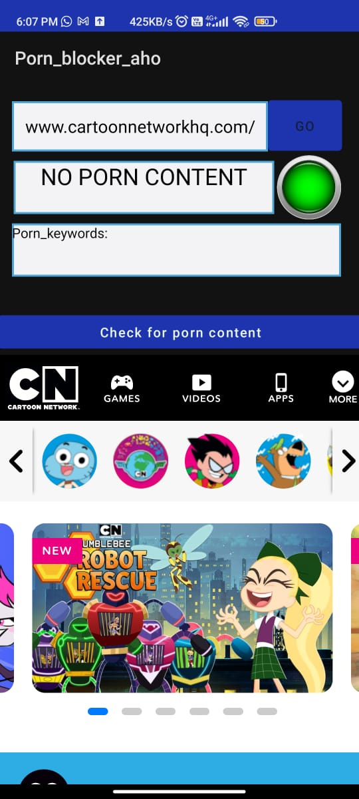

# Porn_blocker_Aho_corasick
Android Browser with inbuilt checker for porn keywords by creating suffix automanton over porn keywords using Aho-Corasick algorithm.

While interacting with in_built browser, user can check for the porn content on the current page in browser which checks for the presence
of porn keywords in the page.

(18+ warning)List of porn keywords used in the project is present in the file "keywords_used" file in root directory and can be modified in
MainActivity.java

## Mobile Application Sceenshots

|                 NO PORN FOUND                 |                 PORN FOUND                       |
|:-------------------------------------------------:|:-------------------------------------------------:|
|  |  |
